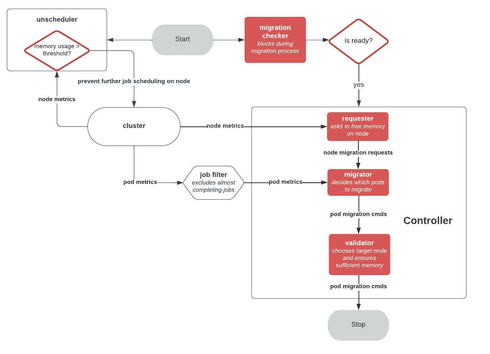

# Kubernetes migration controller

This controller is part of a research project to investigate the feasibility of speculative scheduling of long-running stateful jos with unknown resource requirements in Kubernetes. The controller is intended to migrate stateful workloads in a Kubernetes cluster. This can be useful for resilience to failure and to improve resource utilization through speculative scheduling.

## Demo

A quick demonstration video with a simple workload scenario is available [here](https://www.youtube.com/watch?v=t-TGMeJhXWw&ab_channel=AdrianStobbe)

## Architecture

The controller observes the node memory on the cluster (implemented for InfluxDB).
An architecture flow chart is shown below. The unscheduler component is included as seperate component in the migration simulator.

<!-- A more comprehensive motivation and explaination of the controller can be found in my [Master's thesis]. TODO-->

## How to use

Because container migration is not supported by Kubernetes at the moment, modifications are necessary and a tutorial on how I achieved this can be found [here](https://blog.adrianstobbe.com/tutorial-kubernetes-stateful-pod-migration).

An extended k8s scheduler simulator to evaluate the performance of the migration controller on cluster utilization can be found [here](https://github.com/elchead/k8s-cluster-simulator).
An example with end-to-end integration of the controller inside the scheduler simulator can be found [here](https://github.com/elchead/k8s-cluster-simulator/blob/jobruntime_v1/example/main.go). Please be sure to checkout branch `v1` of the controller for compatibility.

## Run

To use the implemented InfluxDB metric client, create a `.env` file with `INFLUXDB_TOKEN=$TOKEN`. A tutorial on how to install the Influxdb with the metrics agent including the necessary podmetrics is available [here](https://blog.adrianstobbe.com/tutorial-k8s-monitoring-with-influxdbs-telegraf).

The controller issues migration commands, that need to be translated to the interface of how migration is achieved. This implementation is designed to work with the Kubernetes cluster setup referenced above.
The script directory inside `pkg/migration/migration.go` needs to be modified. Sample scripts + yaml manifests are located in the same directory.

Then, simply run the client:
`go run github.com/elchead/k8s-migration-controller/cmd`
